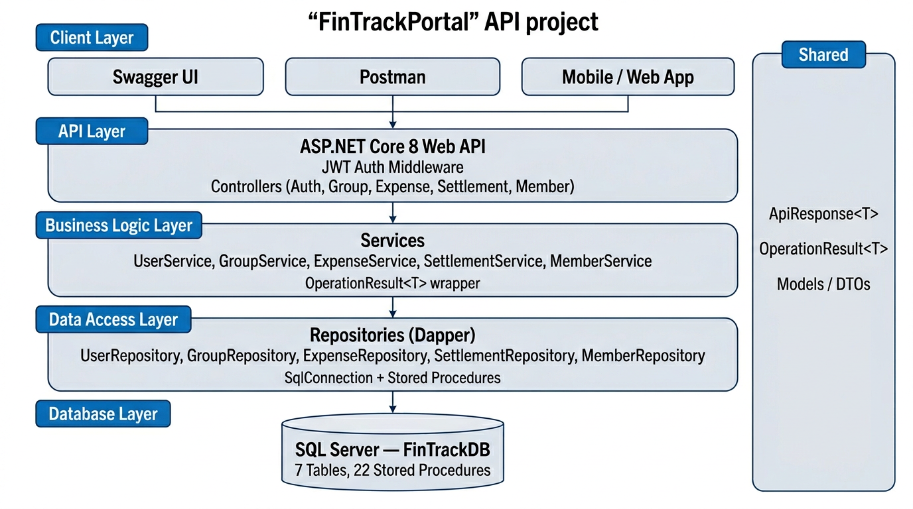

# FinTrackPortal

A RESTful Web API for tracking shared and personal expenses within groups. Built with ASP.NET Core 8, Dapper, and SQL Server (FinShare / FinTrack).

## Tech Stack

| Layer | Technology |
|-------|------------|
| Framework | .NET 8 / ASP.NET Core Web API |
| Database | SQL Server |
| ORM | Dapper (stored procedures) |
| Authentication | JWT access tokens + **opaque refresh tokens** (httpOnly cookie `finshare_refresh`) |
| API Docs | Swagger / Swashbuckle |
| Attachments | **Local disk** or **Azure Blob Storage** (switch via configuration) |
| CI/CD | GitHub Actions → SmarterASP.NET (FTP) |

## Architecture

The solution follows a **layered architecture** with clear separation of concerns.



**Solution layout:**

```
FinTrackPortal.sln
│
├── FinTrackPortal.API            # Controllers, middleware, Program.cs, infrastructure services (email, attachments)
├── FinTrackPortal.Services       # Business logic (service interfaces + implementations)
├── FinTrackPortal.Repositories   # Data access via Dapper + stored procedures
├── FinTrackPortal.Interfaces     # Repository contracts (e.g. `IEmailSender`, `IRefreshTokenRepository`, `IAuditLogRepository`)
├── FinTrackPortal.Models         # DTOs, request/response models, entities
└── FinTrackPortal.Common         # Shared wrappers (ApiResponse<T>, OperationResult<T>)
```

More detail: [Docs/DeveloperGuide.md](Docs/DeveloperGuide.md). **All docs:** [Docs/README.md](Docs/README.md). **Roadmap → files:** [Docs/WhatToDoAndWhere.md](Docs/WhatToDoAndWhere.md). **Configuration:** [Docs/AppSettings.md](Docs/AppSettings.md). **Microsoft 365 email:** [Docs/Email-Microsoft365-Setup.md](Docs/Email-Microsoft365-Setup.md).

## API Endpoints

### Auth (`api/Auth`) — no token required

| Method | Route | Description |
|--------|-------|-------------|
| POST | `/api/Auth/login` | JWT after valid credentials and **verified email**; sets **httpOnly** refresh cookie `finshare_refresh` |
| POST | `/api/Auth/refresh` | New JWT + rotated refresh cookie (send cookie from login; **credentials** required for browser clients) |
| POST | `/api/Auth/revoke` | Revokes refresh session (**logout**); clears cookie |
| POST | `/api/Auth/register` | Creates Member + User; sends verification email (no JWT). **Strong password** enforced server-side |
| POST | `/api/Auth/verify-email` | Body `{ "token" }` from email link |
| POST | `/api/Auth/resend-verification` | Body `{ "email" }`; generic success; rate-limited (same window as forgot-password) |
| POST | `/api/Auth/forgot-password` | Body `{ "email" }`; always returns success (no email enumeration) |
| POST | `/api/Auth/reset-password` | Body `{ "token", "newPassword" }`; strong password rules apply |

**Phase 2 security (rate limits, lockout, audit, token cleanup, refresh tokens):** apply **`Database/FinTrackDB_Migration_Production_SecurityPhase2.sql`** after auth migrations, then **`Database/FinTrackDB_Migration_UserRefreshTokens.sql`** (or use an updated **`FinTrackDB_Schema.sql`**). Optional: **`Database/FinTrackDB_Migration_sp_ResetLoginAttempts.sql`** if you only need the `sp_ResetLoginAttempts` alias. Login is limited to **5 requests / 15 minutes / IP**; register **3/hour/IP**; forgot-password and resend-verification **3/15 minutes/IP**; **refresh** **30/min/IP** (HTTP **429** when exceeded). Client IP for audits uses **`IpHelper`**. Account **lockout** after **5** failed passwords (**15 minutes**). **`AuditLogs`** + hourly **`sp_CleanupExpiredTokens`** (includes expired refresh rows) + daily **`sp_ArchiveAuditLogsRetention`**. **`JwtSettings:RefreshTokenDays`** (default **14**) controls refresh cookie lifetime. Password reset **revokes all refresh tokens** for that member.

Passwords: **BCrypt** (work factor 12, above the spec minimum of 10). Policy: min 8, max 64, no spaces, 1 upper, 1 lower, 1 digit, 1 special from `!@#$%^&*-_=+`.

Configure transactional email under **`Email`**: use **`Provider`** = `MicrosoftGraph` for Microsoft 365 (recommended) or `Smtp` for SMTP relay. Set **`AppPublicUrl`** for verify/reset links. See [Docs/AppSettings.md](Docs/AppSettings.md) and [Docs/Email-Microsoft365-Setup.md](Docs/Email-Microsoft365-Setup.md). If **`Enabled`** is false, verification/reset emails are skipped (logged).

The **Auth enhancements** migration (step 2 in the [Database Schema](#database-schema) table) can set existing users **`IsEmailVerified = 1`** so current accounts keep logging in — see comments inside `FinTrackDB_Migration_Production_AuthEnhancements.sql`.

### Groups (`api/Group`)

| Method | Route | Description |
|--------|-------|-------------|
| POST | `/api/Group/create` | Create a new group (subscription plan limits may apply) |
| POST | `/api/Group/add-member` | Add a member to a group (plan limits may apply) |
| GET | `/api/Group/summary/{groupId}` | Get balance summary (paid, share, net per member) |
| GET | `/api/Group/my-groups` | List groups for the current user |
| GET | `/api/Group/{groupId}/members` | List members of a group with roles |

### Expenses (`api/Expense`)

| Method | Route | Description |
|--------|-------|-------------|
| POST | `/api/Expense/add` | Add a group expense with equal or custom split |
| PUT | `/api/Expense/edit` | Edit a group expense (optional `ExpenseCategory`, `ForReference` on the request body) |
| DELETE | `/api/Expense/delete/{expenseId}` | Soft-delete an expense |
| GET | `/api/Expense/group/{groupId}` | Get expenses for a group |
| POST | `/api/Expense/personal` | Add a personal/office expense (optional `ExpenseCategory`, `ForReference`, `ExpenseDate`, `AccountId`) |
| GET | `/api/Expense/personal` | Get personal/office expenses (optional query `?category=Office` or `Personal`) |
| GET | `/api/Expense/personal/my` | Same as above (alias for clients expecting `/personal/my`) |
| PUT | `/api/Expense/personal/edit` | Update a personal/office expense |
| POST | `/api/Expense/move` | Move an expense to a different group |
| POST | `/api/Expense/payer` | Record a payer amount for multi-payer expenses |
| GET | `/api/Expense/{expenseId}/payers` | List payers and amounts for an expense |
| GET | `/api/Expense/accounts/{userId}` | List account labels for a user |
| POST | `/api/Expense/accounts` | Create a new account label |
| DELETE | `/api/Expense/accounts/{accountId}` | Soft-delete an account label |
| GET | `/api/Expense/attachments/my` | All receipts you uploaded, with linked expense details |
| POST | `/api/Expense/{expenseId}/attachment` | Upload a receipt/invoice (JPG, PNG, PDF); **form field name: `file`** |
| GET | `/api/Expense/{expenseId}/attachments` | List attachments for an expense (each row includes `expenseId`) |
| DELETE | `/api/Expense/attachment/{attachmentId}` | Soft-delete an attachment |

### Settlements (`api/Settlement`)

| Method | Route | Description |
|--------|-------|-------------|
| POST | `/api/Settlement/record` | Record a payment between members |
| GET | `/api/Settlement/group/{groupId}` | Get settlement history for a group |
| GET | `/api/Settlement/suggested/{groupId}` | Get suggested payments to clear all debts |

### Subscriptions (`api/Subscription`)

| Method | Route | Description |
|--------|-------|-------------|
| GET | `/api/Subscription/plans` | List available plans (**public**, no JWT) |
| GET | `/api/Subscription/my` | Get current plan for logged-in user |
| GET | `/api/Subscription/user/{memberId}` | Get current plan for a specific member |
| POST | `/api/Subscription/activate` | Activate a plan after payment |
| POST | `/api/Subscription/cancel` | Cancel the logged-in user's subscription |

### Members (`api/Member`)

| Method | Route | Description |
|--------|-------|-------------|
| POST | `/api/Member/create` | Create a member profile |
| PUT | `/api/Member/edit` | Edit member name |
| DELETE | `/api/Member/delete/{memberId}` | Soft-delete a member |

### Current user (`api/User`)

| Method | Route | Description |
|--------|-------|-------------|
| GET | `/api/User/profile` | Display name, email, phone, profile photo URL |
| PUT | `/api/User/profile` | Update name and phone (not email) |
| POST | `/api/User/profile/photo` | Form field **`photo`** — JPEG/PNG, resized to 200×200 |
| PUT | `/api/User/change-password` | **Current** + **new** password; revokes all refresh tokens |
| GET | `/api/User/bank-details` | Saved bank row (masked IBAN) |
| PUT | `/api/User/bank-details` | Save/update IBAN (requires **`Encryption`** in config) |
| DELETE | `/api/User/bank-details` | Remove saved bank details |

### Transactions (`api/Transaction`)

| Method | Route | Description |
|--------|-------|-------------|
| GET | `/api/Transaction/history?skip=&take=` | Expenses + settlements involving the current user |

### Notifications (`api/Notification`)

| Method | Route | Description |
|--------|-------|-------------|
| GET | `/api/Notification?unreadOnly=&take=` | List notifications |
| PUT | `/api/Notification/{id}/read` | Mark one as read |

### Group events (`api/Group/{groupId}/events`)

| Method | Route | Description |
|--------|-------|-------------|
| GET | `/api/Group/{groupId}/events` | List events (members only) |
| POST | `/api/Group/{groupId}/events` | Create event |
| PUT | `/api/Group/{groupId}/events/{eventId}` | Update (creator only) |
| DELETE | `/api/Group/{groupId}/events/{eventId}` | Soft-delete (creator only) |

### Settlements — payee bank (`api/Settlement`)

| Method | Route | Description |
|--------|-------|-------------|
| GET | `/api/Settlement/{settlementId}/payee-bank-details` | Full **decrypted** IBAN for the payee; **only the payer** (`FromMember`) may call |

> All endpoints except **Auth** (including **`/refresh`** and **`/revoke`**), **GET /api/Subscription/plans**, and **Swagger** require a valid **JWT Bearer** token on each request. The refresh cookie is separate and is used only to obtain a new JWT.

## Configuration

### Base file: `FinTrackPortal.API/appsettings.json`

| Section | Purpose |
|---------|---------|
| `ConnectionStrings:DefaultConnection` | SQL Server connection string |
| `JwtSettings` | Signing key, Issuer, Audience, **`ExpiryMinutes`** (access JWT), **`RefreshTokenDays`** (refresh cookie) |
| `Email` | `Provider` (Graph/SMTP), `Graph:*` or SMTP fields, `AppPublicUrl`, `Enabled` — see [Docs/AppSettings.md](Docs/AppSettings.md) |
| `AttachmentStorage:Provider` | `Azure` (default in repo) or `Local` |
| `AzureStorage` | `ConnectionString`, `ContainerName` — used when `Provider` is `Azure` |
| `LocalStorage` | `Path` (folder on disk or relative to app root), `PublicBaseUrl` (public URL prefix for files, e.g. `https://your-site/attachments`) |
| `Encryption` | `Key` (32-byte base64), `IV` (16-byte base64) — required for **bank IBAN** encryption (`MemberBankDetails`). Leave empty locally if you do not use bank APIs. |

When **`AttachmentStorage:Provider`** is **`Local`**, the API saves files under `LocalStorage:Path`, serves them at `/attachments`, and stores URLs in `ExpenseAttachment`. Profile photos are stored under `profiles/` in the same folder or as `profiles/{memberId}.jpg` in Azure. When **`Azure`**, files go to Blob Storage.

### Production: `appsettings.Production.json`

This file is **gitignored** so secrets are not committed. Use the committed template:

- **`FinTrackPortal.API/appsettings.Production.example.json`** — copy to `appsettings.Production.json` and replace placeholders.

Set hosting environment to **Production** (`ASPNETCORE_ENVIRONMENT=Production` on the server).

**SmarterASP / shared hosting tips**

- Prefer a **writable folder** under your application root, e.g. relative `Attachments`, or an absolute path such as `h:\root\home\<account>\www\<app>\Attachments`.
- **`LocalStorage:PublicBaseUrl`** must match how users reach your API over HTTPS, e.g. `https://your-domain.com/attachments` (no trailing slash).
- Do **not** point `LocalStorage:Path` at the site root only (`.`); the app normalizes that to `App_Data/attachments` or use an explicit subfolder.

### Secrets on GitHub / CI

Store production connection strings and JWT keys in **GitHub Actions secrets** or your host’s **application settings** / environment variables rather than in committed JSON.

## Database Schema

**New / greenfield environment** — full script (drops/recreates `FinTrackDB`; **SQL Server 2016+**):

```
Database/FinTrackDB_Schema.sql
```

Use only when you intend to rebuild the database; read the script header.

**Existing database** — apply migrations **in order** (back up first; adjust `USE [YourDatabase]` if needed):

| Order | Script | Purpose |
|-------|--------|---------|
| 1 | `Database/FinTrackDB_Migration_Production_Phase3.sql` | Phase 3 columns, `ExpensePayer`, procedure updates |
| 2 | `Database/FinTrackDB_Migration_Production_AuthEnhancements.sql` | Email verify + password reset columns and auth SPs |
| 3 | `Database/FinTrackDB_Migration_Production_SecurityPhase2.sql` | Lockout, `AuditLogs`, token cleanup, audit SPs, `sp_ResetLoginAttempts` |
| 4 | `Database/FinTrackDB_Migration_UserRefreshTokens.sql` | `UserRefreshTokens`, refresh SPs, `sp_GetUserEmailByMemberId`, extends `sp_CleanupExpiredTokens` |
| 5 | `Database/FinTrackDB_Migration_NewFeatures_Phase3to5.sql` | Profile (`ProfilePhotoUrl`), transaction history SPs, `Notifications`, `MemberBankDetails`, `GroupEvents` |

Optional: `Database/FinTrackDB_Migration_sp_ResetLoginAttempts.sql` only if you already ran Phase 2 before that procedure existed.

Optional: `Database/FinTrackDB_Migration_Production_GroupEvents_GroupIdGuard.sql` — run **only** if you applied step 5 **before** `sp_UpdateGroupEvent` / `sp_DeleteGroupEvent` took `@GroupId` (keeps route `groupId` and DB row in sync; newer copies of step 5 already include this).

Optional: `Database/FinTrackDB_Migration_Production_Notifications_RenameTable.sql` — run if an older step 5 used **`dbo.Notification`** or **`CreatedAt`** without **`ModifiedDate`** / **`IsActive`**; aligns with **`FinTrackDB_Schema.sql`** (`CreatedDate`, `ModifiedDate`, `IsActive`) and refreshes notification SPs.

After **`sp_ValidateUser`** / BCrypt changes, users need valid **BCrypt** `PasswordHash` (re-register, password reset, or controlled `UPDATE`). **`FinTrackDB_Migration_Production_AuthEnhancements.sql`** can set existing users `IsEmailVerified = 1` so logins keep working — see script comments.

### Tables (high level)

| Table | Description |
|-------|-------------|
| `Member` | Member profile |
| `Users` | Login credentials linked to a Member |
| `Groups` | Expense-sharing groups |
| `GroupMember` | Groups ↔ members (with role) |
| `Expense` | Group or personal expenses; optional `AccountId`, `CostCenterId` |
| `ExpenseSplit` | Per-member share of each expense |
| `Settlement` | Settlements between members |
| `SubscriptionPlan` | Plan definitions (limits, pricing) |
| `UserSubscription` | Member subscriptions (`MemberId`) |
| `ExpenseAccount` | User-defined account labels |
| `ExpenseAttachment` | Metadata for files (URL points to local `/attachments` or Azure blob) |
| `ExpensePayer` | Optional split of who paid how much on a single expense (multi-payer) |
| `Organisation` / `CostCenter` | Corporate foundation (reserved for future use) |
| `AuditLogs` / `AuditLogs_Archive` | Security audit trail (Phase 2); retention via `sp_ArchiveAuditLogsRetention` |
| `UserRefreshTokens` | Opaque refresh tokens for JWT rotation (httpOnly cookie flow) |
| `Notifications` | In-app notifications per member (`CreatedDate` / `ModifiedDate` / `IsActive`, same audit style as `Expense`, `Member`) |
| `MemberBankDetails` | Encrypted IBAN + masked display (one row per member) |
| `GroupEvents` | Group calendar events (soft-delete) |

Stored procedures are documented inline in `FinTrackDB_Schema.sql` and summarized in the Developer Guide.

## Getting Started

### Prerequisites

- [.NET 8 SDK](https://dotnet.microsoft.com/download/dotnet/8.0)
- SQL Server (local, Azure SQL, or host-provided SQL)

### Local setup

1. **Clone**

```bash
git clone https://github.com/<your-username>/FinTrackPortal.git
cd FinTrackPortal
```

2. **Database** — execute `Database/FinTrackDB_Schema.sql` in SSMS or:

```bash
sqlcmd -S localhost -i Database/FinTrackDB_Schema.sql
```

3. **Configure** — copy **`FinTrackPortal.API/appsettings.Development.example.json`** → **`appsettings.Development.json`** (gitignored) or edit **`appsettings.json`**. Set SQL connection string, JWT key, **`JwtSettings:RefreshTokenDays`** if needed, **`Email`** (or `Email:Enabled` = false), and attachment mode (`Local` or `Azure`). For an **existing** database, run the [migration scripts](#database-schema) in order, not only `FinTrackDB_Schema.sql`.

4. **Run**

```bash
dotnet restore
dotnet build
dotnet run --project FinTrackPortal.API
```

5. Open **Swagger** at `https://localhost:<port>/swagger`. **Note:** Swagger does not automatically send the **refresh** cookie; use **Postman** or a browser client with **`credentials: 'include'`** to test **`POST /api/Auth/refresh`** and **`POST /api/Auth/revoke`**.

### Postman

Files in the **repository root**:

| File | Purpose |
|------|---------|
| `FinTrackPortal.postman_collection.json` | All modules + **Tests** tab scripts |
| `FinTrackPortal.postman_environment_Local.json` | `baseUrl` for local HTTPS |
| `FinTrackPortal.postman_environment_Production.json` | Production `baseUrl` template |

1. Import the collection and one environment; set **`loginEmail`** and **`loginPassword`**.
2. Run **Auth → Login** — saves **`token`**, **`memberId`**, and **`email`** as collection variables (Bearer auth is inherited). If your Postman build stores cookies from responses, you can call **Auth → Refresh** after access token expiry; otherwise re-run Login or manually manage the **`finshare_refresh`** cookie.
3. Set **`groupId`** (e.g. copy from **Group → My Groups**) and align **`paidBy`** / **`members`** in expense JSON with real member IDs from your database.

**Expense attachments (receipts)** — minimal flow:

1. **Expense → Add Expense (Equal Split)** *or* **Personal → Add Personal Expense** — both store **`expenseId`** in collection variables on success.
2. **Expense → Upload expense attachment** — Body **form-data**: key **`file`**, type **File**, pick `.jpg` / `.png` / `.pdf`. On success, **`attachmentId`** is saved for delete.
3. **List expense attachments** then **Delete expense attachment** (or use the negative tests: no file, wrong extension).

**Run the whole suite:** Collection → **Run** → select folders (Auth, Group, Expense, Settlement, Subscription, Member, Personal, Security Tests) → **Run**. You must still choose a file manually for **Upload expense attachment** when that request runs; set **`groupId`** and member IDs before a full run.

The collection **description** (View → Show description) has the same steps in more detail.

## CI/CD

GitHub Actions (`.github/workflows/main.yml`): restore → build (Release) → publish → deploy to SmarterASP via FTP (on push).

## License

This project is for personal/educational use.
